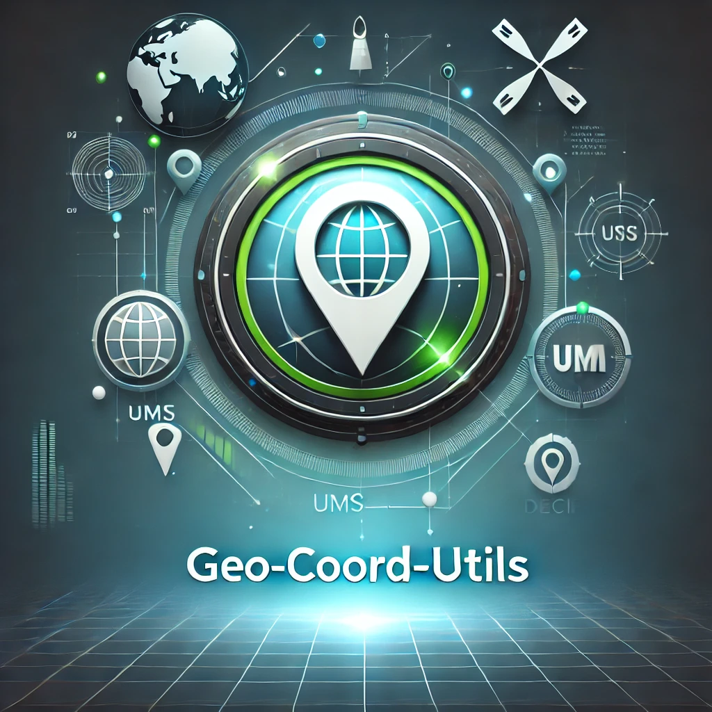

# Geo-Coord-Utils
<div style="text-align: center; margin-bottom: 20px">
    
</div>
This library provides functions to convert coordinates between DMS (Degrees, Minutes, Seconds), UTM (Universal Transverse Mercator), and decimal (latitude/longitude) formats in JavaScript.

## Installation

You can install this library using npm:

```bash
npm install geo-coord-utils
```

## Usage

### Importing the Library

```javascript
const { UTMToDMS, UTMToLatLon, LatLonToUTM, LatLonToDMS, DMSToLatLon, DMSToUTM } = require('geo-coord-utils');
```

### Converting UTM to Lat/Lon

To convert coordinates from UTM to latitude/longitude:

```javascript
const utmCoords = {
  easting: 567047.1966208686,
  northing: 4478055.059933961,
  zoneNum: 17,
  zoneLetter: 'T'
};

const latLonCoords = UTMToLatLon(utmCoords);
console.log('UTM to Lat/Lon:', latLonCoords);
```

### Converting UTM to DMS

To convert coordinates from UTM to DMS:

```javascript
const dmsCoords = UTMToDMS(utmCoords);
console.log('UTM to DMS:', dmsCoords);
```

### Converting DMS to UTM

To convert coordinates from DMS to UTM:

```javascript
const dmsToUtmExample = {
  latD: 40,
  latM: 26,
  latS: 46,
  latDir: 'N',
  lonD: 79,
  lonM: 58,
  lonS: 56,
  lonDir: 'W'
};

const utmCoords = DMSToUTM(dmsToUtmExample);
console.log('DMS to UTM:', utmCoords);
```

### Converting DMS to Lat/Lon

To convert coordinates from DMS to latitude/longitude:

```javascript
const dmsToLatLonExample = {
  latD: 40,
  latM: 26,
  latS: 46,
  latDir: 'N',
  lonD: 79,
  lonM: 58,
  lonS: 56,
  lonDir: 'W'
};

const latLonCoords = DMSToLatLon(dmsToLatLonExample);
console.log('DMS to Lat/Lon:', latLonCoords);
```

### Converting Lat/Lon to UTM

To convert coordinates from latitude/longitude to UTM:

```javascript
const lat = 40.446195;
const lon = -79.982222;

const utmCoords = LatLonToUTM(lat, lon);
console.log('Lat/Lon to UTM:', utmCoords);
```

### Converting Lat/Lon to DMS

To convert coordinates from latitude/longitude to DMS:

```javascript
const lat = 40.446195;
const lon = -79.982222;

const dmsCoords = LatLonToDMS(lat, lon);
console.log('Lat/Lon to DMS:', dmsCoords);
```

## Functions

### DMSToUTM(latDeg, latMin, latSec, latDir, lonDeg, lonMin, lonSec, lonDir)

Converts DMS coordinates to UTM coordinates.

**Parameters:**
- `latD`: Latitude degrees
- `latM`: Latitude minutes
- `latS`: Latitude seconds
- `latDir`: Latitude direction ('N' or 'S')
- `lonD`: Longitude degrees
- `lonM`: Longitude minutes
- `lonS`: Longitude seconds
- `lonDir`: Longitude direction ('E' or 'W')

**Returns:**
- An object containing UTM coordinates (`easting`, `northing`, `zoneNum`, `zoneLetter`).

### UTMToDMS(easting, northing, zoneNum, zoneLetter)

Converts UTM coordinates to DMS coordinates.

**Parameters:**
- `easting`: Easting value
- `northing`: Northing value
- `zoneNum`: UTM zone number
- `zoneLetter`: UTM zone letter

**Returns:**
- An object containing DMS coordinates (`lat`, `lon`).

### UTMToLatLon(easting, northing, zoneNum, zoneLetter)

Converts UTM coordinates to latitude/longitude coordinates.

**Parameters:**
- `easting`: Easting value
- `northing`: Northing value
- `zoneNum`: UTM zone number
- `zoneLetter`: UTM zone letter

**Returns:**
- An object containing latitude/longitude coordinates (`latitude`, `longitude`).

### LatLonToUTM(lat, lon)

Converts latitude/longitude coordinates to UTM coordinates.

**Parameters:**
- `lat`: Latitude value
- `lon`: Longitude value

**Returns:**
- An object containing UTM coordinates (`easting`, `northing`, `zoneNum`, `zoneLetter`).

### LatLonToDMS(lat, lon)

Converts latitude/longitude coordinates to DMS coordinates.

**Parameters:**
- `lat`: Latitude value
- `lon`: Longitude value

**Returns:**
- An object containing DMS coordinates (`lat`, `lon`).

### DMSToLatLon(latDeg, latMin, latSec, latDir, lonDeg, lonMin, lonSec, lonDir)

Converts DMS coordinates to latitude/longitude coordinates.

**Parameters:**
- `latD`: Latitude degrees
- `latM`: Latitude minutes
- `latS`: Latitude seconds
- `latDir`: Latitude direction ('N' or 'S')
- `lonD`: Longitude degrees
- `lonM`: Longitude minutes
- `lonS`: Longitude seconds
- `lonDir`: Longitude direction ('E' or 'W')

**Returns:**
- An object containing latitude/longitude coordinates (`lat`, `lon`).

## License

This project is licensed under the MIT License - see the [LICENSE](./LICENSE) file for details.
